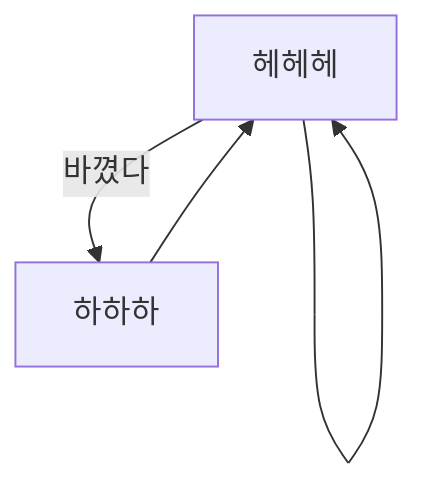
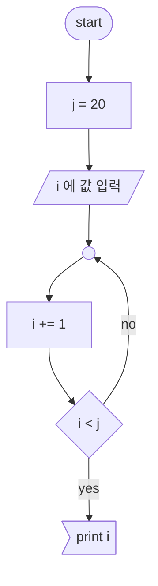
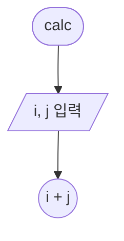
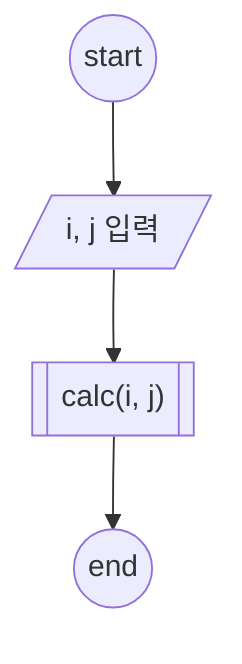
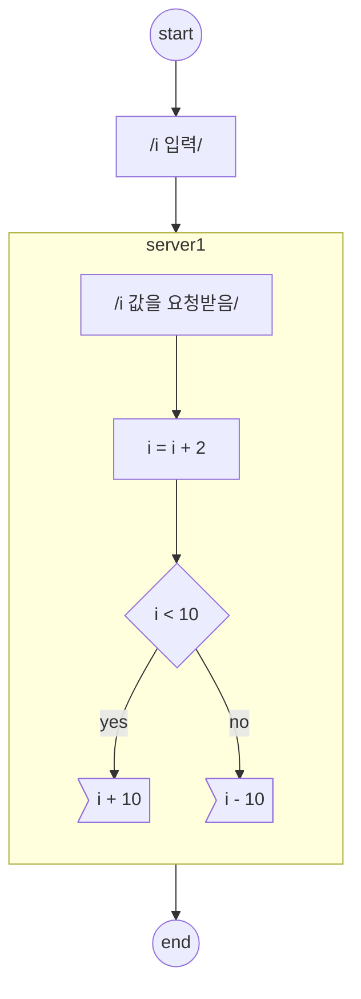

# test 폴더

여기 테스트임

```mermaid
flowchart TB
  a["헤헤헤"]
  b["하하하"]
  a -->|바꼈다| b
  a --> a
  b --> a
```

```mermaid
flowchart TB
  st(["start"])
  p1["j = 20"]
  inp1[/i 에 값 입력/]
  b1(("  "))
  p2["i += 1"]
  cond1{"i < j"}
  out1>"print i"]
  st --> p1
  p1 --> inp1
  inp1 --> b1
  b1 --> p2
  p2 --> cond1
  cond1 -->|no| b1
  cond1 -->|yes| out1
```

```mermaid
flowchart TB
  st(["calc"])
  inp1[/i, j 입력/]
  en(("i + j"))
  st --> inp1 --> en
```

```mermaid
flowchart TB
  st(("start"))
  inp[/i, j 입력/]
  calc[["calc(i, j)"]]
  en(("end"))
  st --> inp --> calc --> en
```

```mermaid
flowchart TB
  st(("start"))
  inp["/i 입력/"]
  en(("end"))
  subgraph s1["server1"]
    direction TB
    inp2["/i 값을 요청받음/"]
    p1["i = i + 2"]
    c1{"i < 10"}
    o1>"i + 10"]
    o2>"i - 10"]
    inp2 --> p1 --> c1 -->|yes| o1
    c1 -->|no| o2
  end
  st --> inp --> s1 --> en
```
